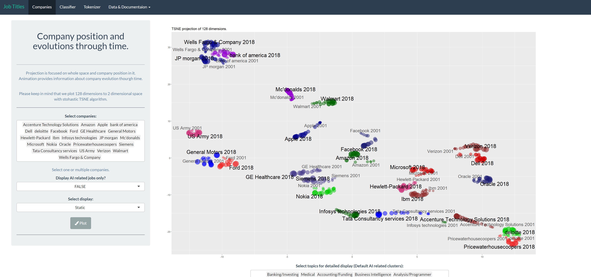
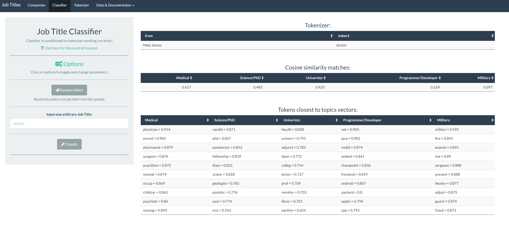
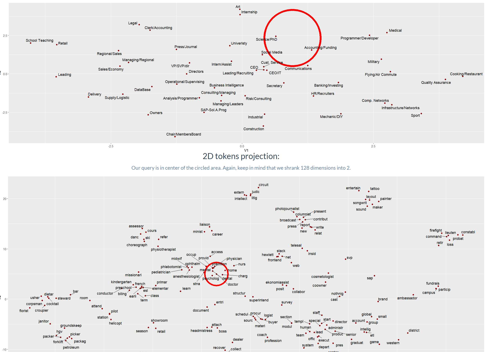
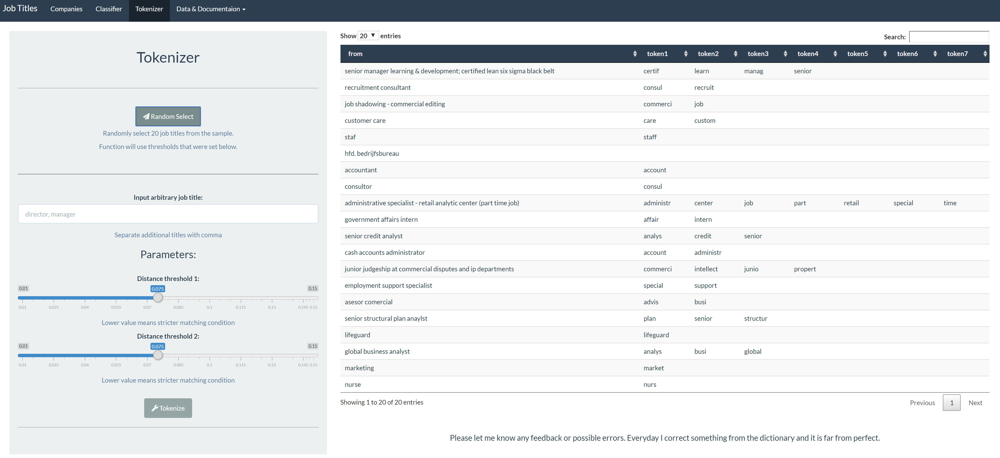
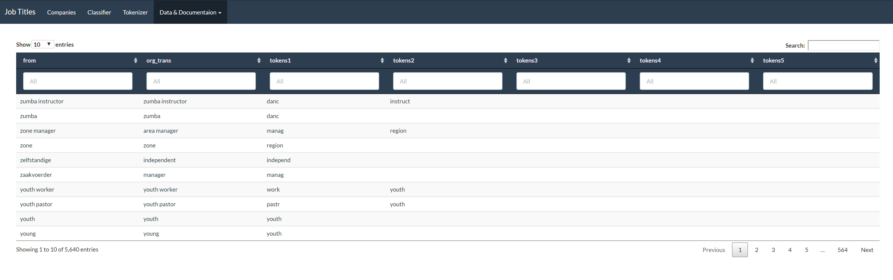
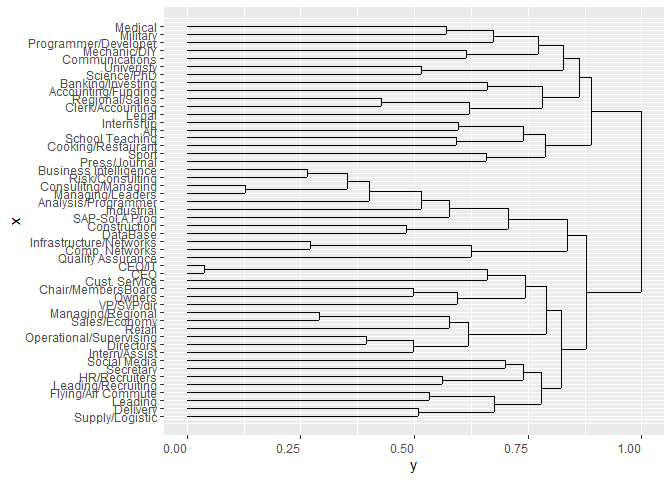

1.  [Installation](#install)
2.  [App](#app)
3.  [Basic
functions](#basic)
4.  [Python](#py)

## <a name="install"></a> <span style="color:brown">1. Installation:</span>

Package designed for unsupervised analysis of job titles.

You can see the app on shinyapps.io as well:
<https://fmfjelencicj14.shinyapps.io/JobTitlesAI/>

``` r
devtools::install_github("masterlord99/CognismR",dependencies = T)
library(CognismR)
```

## <a name="app"></a> <span style="color:brown">2. App:</span>

App conatins more detailed description of workflow, some fancier
visualizations and animations. We plot embeddings with TSNE projection.

One can run the app via command:

``` r
run_APP()
```

One can observe comparisson of companies evolving through time:

<!-- -->

One can observe animation of company evolution through time:


One can observe classification process and play with the
options/plotting.

<!-- -->

By default TSNE plot is set to FALSE. You can turn it on in options
(green link). Example TSNE projection, first plot is the position of
query in the carrriers space, second one is the position of the query in
the tokens space. TSNE examples:

<!-- -->

One can also observe hot tokenizer works.

<!-- -->

Finally one can examine the dictionary and also detailed
workflow.

<!-- -->

## <a name="basic"></a> <span style="color:brown">3. Basic functions:</span>

Few example how to use pretrained embedding, how to extract similarities
and how to observe vectorized space.

### Get Embedding Matrix:

Rownames are stemmed tokens, columns present embedded dimensions.

``` r
em_mat <- get_embedding_matrix()
em_mat[1:5,1:3]
```

``` 
               [,1]         [,2]          [,3]
<NA>    0.007545756  0.017859198  0.0008331018
start  -0.142710701  0.009520384 -0.0298519488
stop   -0.020756768 -0.087701730 -0.0408388078
abap    0.462419689  0.225011796  0.4949521124
academ -0.642185032  0.235870302 -0.0057583926
```

``` r
dim(em_mat)
```

    [1] 878 128

### Get Vectorized Space:

Carriers of our space are 50 vectors that represent specific fields of
job titles. Carriers are constructed as most important beta
probabilities of LDA clustering, then vectorized with LSTM emebddings.
Detailed procedure explained in app.

``` r
space <- get_vectorized_space()
space[1:5,1:3]
```

``` 
                         [,1]       [,2]        [,3]
DataBase           -0.5904165 -2.4898740  0.26440982
Cust. Service       0.7171006  0.1684387  0.01098271
Intern/Assist       0.3288543  0.1963175  0.00242556
Comp. Networks     -1.1595577  1.1932753  2.43192239
Accounting/Funding -5.2158005 -2.7834680 -0.95281171
```

``` r
dim(space)
```

    [1]  50 128

### Get Similarities between Carriers:

``` r
space_sim <- get_space_distances()
space_sim[1:5,1:3]
```

``` 
                      DataBase Cust. Service Intern/Assist
DataBase            1.00000000  -0.017906835    0.20584760
Cust. Service      -0.01790684   1.000000000    0.15314007
Intern/Assist       0.20584760   0.153140068    1.00000000
Comp. Networks      0.17999082  -0.003295282    0.05573919
Accounting/Funding  0.06128189  -0.071998136    0.11294712
```

``` r
dim(space)
```

    [1]  50 128

Visualize Similarities as dendogram (More visualizations embedded in the
app). Dendogram works with tokens embedding aswell:

``` r
dend(get_vectorized_space())
```

<!-- -->

### Assign Tokens to Job Titles:

Function is vectorized, if tokenizer cannot find appropriate token it
assign NA. Always returns data frame of queries and assigned tokens. It
can handle miss-spellings and multilingual
input.

``` r
query <- c("diretor of finance","i.t manager", "manger","null example","lerherin", 
           "asesor en computación asuntos informáticos y tecnologicos", "qa and qc inspector")
assignRoleTokens(query)
```

``` 
                                                       from   token1
1                                        diretor of finance director
2                                               i.t manager    manag
3                                                    manger    manag
4                                              null example     <NA>
5                                                  lerherin    teach
6 asesor en computación asuntos informáticos y tecnologicos    advis
7                                       qa and qc inspector    assur
   token2  token3  token4 token5
1  financ    <NA>    <NA>   <NA>
2  inform  system    <NA>   <NA>
3    <NA>    <NA>    <NA>   <NA>
4    <NA>    <NA>    <NA>   <NA>
5    <NA>    <NA>    <NA>   <NA>
6  comput  inform  system   tech
7 control inspect qualiti   <NA>
```

### Get embeddings of job titles:

Function is vectorized, it returns a matrix. Matrix has NA values if no
tokens were asigned. It throws warning when tokenization is not
complete.

``` r
query <- c("diretor of finance","i.t manager", "manger","null example","lerherin", 
           "asesor en computación asuntos informáticos y tecnologicos", "qa and qc inspector")
mat <- get_embedded_titles(query)
```

    Warning in get_embedded_titles(query): Unable to tokenize some queries!

``` r
mat[,1:3]## display only first 3 dimensions
```

``` 
            [,1]        [,2]        [,3]
[1,] -0.21400524  0.13608960  0.05363690
[2,]  0.35823736  0.02607548  0.06295383
[3,]  0.89831972 -0.09024193 -0.01522450
[4,]          NA          NA          NA
[5,]  0.06338885 -0.12312835 -0.03173677
[6,]  0.27146676 -0.01144826  0.06181821
[7,] -0.30475684  0.39828911 -0.07204077
```

### Get most similiar tokens:

Function takes in query and returns list of best fitting matches and
query embedding. Where token cannot be assigned it returns null.

``` r
query <- c("basketball coach","i.t manager","null")
get_tokens_matching(query)
```

    Warning in get_embedded_titles(query): Unable to tokenize some queries!

    $`basketball coach`
    $`basketball coach`$query
    [1] "basketball coach"
    
    $`basketball coach`$matches
     basketbal      coach profession    footbal     player       golf 
     0.9011277  0.8821931  0.8452270  0.8451950  0.8442125  0.8389843 
           fit  lifeguard       time       swim 
     0.8260791  0.8149562  0.8020530  0.7916132 
    
    $`basketball coach`$vectorized
      [1] -0.370643258  0.051088188 -0.058269208  0.018476885  0.179422729
      [6]  0.077582295 -0.121036276 -0.470421165 -0.090518288 -0.319906160
     [11]  0.198131688 -0.079503903  0.242269024  0.161453642  0.050290229
     [16]  0.379861966 -0.151603967 -0.329067595 -0.107639845  0.187942218
     [21]  0.015169233 -0.058369525 -0.170178548  0.051260068  0.272943877
     [26]  0.080182412  0.365243919  0.200986855  0.106134314 -0.101912796
     [31] -0.185579726 -0.307075977 -0.292408898 -0.887795091  0.098010074
     [36] -0.220851868 -0.294932604 -0.056276288 -0.165723130  0.280578718
     [41]  0.084549502  0.103550173 -0.028236978  0.055187222  0.034699514
     [46]  0.255585484 -0.115959004  0.235459538  0.016411502 -0.422235265
     [51]  0.016533483  0.015594218  0.265098430  0.424995422  0.304875091
     [56] -0.096219538  0.119107902 -0.048654594  0.303617485 -0.051377863
     [61] -0.114577178 -0.261265196  0.003448736 -0.060226694  0.147815973
     [66]  0.280617088 -0.324693367  0.024653351  0.188127339  0.114773482
     [71]  0.136037432 -0.313624640 -0.067248276 -0.225088969  0.064690951
     [76]  0.024559848 -0.042120337  0.059886083 -0.110965010  0.074158264
     [81]  0.086370971 -0.099379331 -0.109980727  0.062889736  0.161266205
     [86]  0.198361717  0.143968828  0.030397644 -0.032455879  0.172891766
     [91]  0.098052805  0.069172882 -0.623125911 -0.415346220  0.167979889
     [96] -0.098582156 -0.249927357  0.073214757  0.232702911 -0.055229250
    [101]  0.231514819 -0.040957434  0.115660623 -0.097386992 -0.132760853
    [106]  0.127271274 -0.056990189  0.187663577 -0.062800290  0.156056990
    [111]  0.086857401  0.279750422  0.098493969  0.579691738 -0.220040232
    [116] -0.325511679 -0.474516928 -0.255391758 -0.103700750  0.086217079
    [121]  0.014855674 -0.014544144  0.457123250  0.086916473 -0.009846531
    [126]  0.283631638 -0.091875490  0.047274821
    
    
    $`i.t manager`
    $`i.t manager`$query
    [1] "i.t manager"
    
    $`i.t manager`$matches
        system     inform      manag    support      offic    network 
     0.8504749  0.8189275  0.5414985  0.4106289  0.3896544  0.3873753 
        execut      train profession      advis 
     0.3839128  0.3752547  0.3650289  0.3494833 
    
    $`i.t manager`$vectorized
      [1]  0.3582373553  0.0260754799  0.0629538264 -0.0511471356 -0.0086196875
      [6] -0.1871842028  0.1195104371  0.0625751776  0.0183632473  0.4203315551
     [11] -0.0958306324  0.2074399156  0.1485999515  0.0425961489  0.2248243044
     [16]  0.2414140403 -0.0703675219 -0.8663745721 -0.1426250438 -0.0712754490
     [21]  0.0845700397  0.0849316415 -0.0767470007  0.1447786102 -0.0865770075
     [26] -0.1490715779  0.0974187572  0.0112407890 -0.0294002021  0.0001802295
     [31] -0.7058828920  0.1032128483  0.0339904552 -0.7577698827 -0.1339399020
     [36]  0.0575693833 -0.0686266930 -0.1437977999 -0.1240549212  0.0702879876
     [41] -0.2474849919 -0.0566582276  0.0435977876 -0.1230732485  0.0303891748
     [46] -0.0871809026  0.1366351421 -0.1422832025  0.0087170762 -0.0045787555
     [51]  0.0505415847 -0.0010780742 -0.0322001521  0.3074576184  0.0698608843
     [56] -0.1393217569  0.1008536667  0.1636573177 -0.0386621480  0.1137595947
     [61] -0.0491632012 -0.0276054790  0.0041255976 -0.2039370007 -0.0676909350
     [66]  0.2439540277 -0.1171061397 -0.0633158612  0.1100761543 -0.1836260880
     [71]  0.0012457588 -0.5113434841 -0.1132790744 -0.0343514035 -0.0098307505
     [76] -0.0207386253 -0.1267372444  0.0760832354  0.1385638397  0.2578253845
     [81]  0.0368567550 -0.0779262309 -0.0626307297  0.0103095037  0.6059519649
     [86]  0.0746793480 -0.0773528752  0.0743691263 -0.1031993718  0.0587249467
     [91]  0.0258941458  0.1676962016 -0.1839425564 -0.4017991722 -0.0946893729
     [96] -0.0518909010  0.3409327026  0.0370354488 -0.2738890747 -0.1861857126
    [101]  0.1887111912  0.0267259404  0.0951025821  0.0278830317 -0.1062195456
    [106] -0.1290132230  0.0877701392  0.5032765859 -0.5002657523  0.1738956670
    [111]  0.0312448693 -0.1472205929 -0.0745343496  0.1251659654 -0.5759967864
    [116] -0.0873423796  0.7366953641 -0.1447634101 -0.0433856541  0.1103537281
    [121]  0.0201448795 -0.0282285449 -0.0959319274  0.1631980936 -0.0011249088
    [126]  0.4098551969  0.3162041182 -0.1530520866
    
    
    $null
    NULL

### Get distance to the closest space carriers:

Function takes in query and returns list of best fitting matches and
query embedding. Where token cannot be assigned it returns null.

``` r
query <- c("basketball coach","i.t manager","investing banker")
get_space_matching(query)
```

    $`basketball coach`
    $`basketball coach`$query
    [1] "basketball coach"
    
    $`basketball coach`$matches
                      Sport Infrastructure/Networks           Press/Journal 
                 0.91154952              0.25650793              0.14800963 
              HR/Recruiters          Communications                DataBase 
                 0.14441659              0.11119527              0.09536985 
                        CEO                  CEO/IT                 Medical 
                 0.09203647              0.07066243              0.07015603 
                  Secretary 
                 0.07000605 
    
    $`basketball coach`$vectorized
      [1] -0.370643258  0.051088188 -0.058269208  0.018476885  0.179422729
      [6]  0.077582295 -0.121036276 -0.470421165 -0.090518288 -0.319906160
     [11]  0.198131688 -0.079503903  0.242269024  0.161453642  0.050290229
     [16]  0.379861966 -0.151603967 -0.329067595 -0.107639845  0.187942218
     [21]  0.015169233 -0.058369525 -0.170178548  0.051260068  0.272943877
     [26]  0.080182412  0.365243919  0.200986855  0.106134314 -0.101912796
     [31] -0.185579726 -0.307075977 -0.292408898 -0.887795091  0.098010074
     [36] -0.220851868 -0.294932604 -0.056276288 -0.165723130  0.280578718
     [41]  0.084549502  0.103550173 -0.028236978  0.055187222  0.034699514
     [46]  0.255585484 -0.115959004  0.235459538  0.016411502 -0.422235265
     [51]  0.016533483  0.015594218  0.265098430  0.424995422  0.304875091
     [56] -0.096219538  0.119107902 -0.048654594  0.303617485 -0.051377863
     [61] -0.114577178 -0.261265196  0.003448736 -0.060226694  0.147815973
     [66]  0.280617088 -0.324693367  0.024653351  0.188127339  0.114773482
     [71]  0.136037432 -0.313624640 -0.067248276 -0.225088969  0.064690951
     [76]  0.024559848 -0.042120337  0.059886083 -0.110965010  0.074158264
     [81]  0.086370971 -0.099379331 -0.109980727  0.062889736  0.161266205
     [86]  0.198361717  0.143968828  0.030397644 -0.032455879  0.172891766
     [91]  0.098052805  0.069172882 -0.623125911 -0.415346220  0.167979889
     [96] -0.098582156 -0.249927357  0.073214757  0.232702911 -0.055229250
    [101]  0.231514819 -0.040957434  0.115660623 -0.097386992 -0.132760853
    [106]  0.127271274 -0.056990189  0.187663577 -0.062800290  0.156056990
    [111]  0.086857401  0.279750422  0.098493969  0.579691738 -0.220040232
    [116] -0.325511679 -0.474516928 -0.255391758 -0.103700750  0.086217079
    [121]  0.014855674 -0.014544144  0.457123250  0.086916473 -0.009846531
    [126]  0.283631638 -0.091875490  0.047274821
    
    
    $`i.t manager`
    $`i.t manager`$query
    [1] "i.t manager"
    
    $`i.t manager`$matches
    Infrastructure/Networks                  CEO/IT     Consulitng/Managing 
                  0.5849778               0.4146249               0.3962840 
                        CEO   Business Intelligence Operational/Supervising 
                  0.3867797               0.3479418               0.3112931 
                  Directors     Analysis/Programmer              Industrial 
                  0.2746358               0.2746189               0.2659767 
            Risk/Consulting 
                  0.2651808 
    
    $`i.t manager`$vectorized
      [1]  0.3582373553  0.0260754799  0.0629538264 -0.0511471356 -0.0086196875
      [6] -0.1871842028  0.1195104371  0.0625751776  0.0183632473  0.4203315551
     [11] -0.0958306324  0.2074399156  0.1485999515  0.0425961489  0.2248243044
     [16]  0.2414140403 -0.0703675219 -0.8663745721 -0.1426250438 -0.0712754490
     [21]  0.0845700397  0.0849316415 -0.0767470007  0.1447786102 -0.0865770075
     [26] -0.1490715779  0.0974187572  0.0112407890 -0.0294002021  0.0001802295
     [31] -0.7058828920  0.1032128483  0.0339904552 -0.7577698827 -0.1339399020
     [36]  0.0575693833 -0.0686266930 -0.1437977999 -0.1240549212  0.0702879876
     [41] -0.2474849919 -0.0566582276  0.0435977876 -0.1230732485  0.0303891748
     [46] -0.0871809026  0.1366351421 -0.1422832025  0.0087170762 -0.0045787555
     [51]  0.0505415847 -0.0010780742 -0.0322001521  0.3074576184  0.0698608843
     [56] -0.1393217569  0.1008536667  0.1636573177 -0.0386621480  0.1137595947
     [61] -0.0491632012 -0.0276054790  0.0041255976 -0.2039370007 -0.0676909350
     [66]  0.2439540277 -0.1171061397 -0.0633158612  0.1100761543 -0.1836260880
     [71]  0.0012457588 -0.5113434841 -0.1132790744 -0.0343514035 -0.0098307505
     [76] -0.0207386253 -0.1267372444  0.0760832354  0.1385638397  0.2578253845
     [81]  0.0368567550 -0.0779262309 -0.0626307297  0.0103095037  0.6059519649
     [86]  0.0746793480 -0.0773528752  0.0743691263 -0.1031993718  0.0587249467
     [91]  0.0258941458  0.1676962016 -0.1839425564 -0.4017991722 -0.0946893729
     [96] -0.0518909010  0.3409327026  0.0370354488 -0.2738890747 -0.1861857126
    [101]  0.1887111912  0.0267259404  0.0951025821  0.0278830317 -0.1062195456
    [106] -0.1290132230  0.0877701392  0.5032765859 -0.5002657523  0.1738956670
    [111]  0.0312448693 -0.1472205929 -0.0745343496  0.1251659654 -0.5759967864
    [116] -0.0873423796  0.7366953641 -0.1447634101 -0.0433856541  0.1103537281
    [121]  0.0201448795 -0.0282285449 -0.0959319274  0.1631980936 -0.0011249088
    [126]  0.4098551969  0.3162041182 -0.1530520866
    
    
    $`investing banker`
    $`investing banker`$query
    [1] "investing banker"
    
    $`investing banker`$matches
          Banking/Investing         Risk/Consulting Infrastructure/Networks 
                 0.73206693              0.17412810              0.16678519 
              Sales/Economy                  CEO/IT                 Leading 
                 0.13322928              0.12993280              0.10842382 
                     Owners       Managing/Regional                     CEO 
                 0.10669635              0.10556606              0.09434977 
         Chair/MembersBoard 
                 0.09264573 
    
    $`investing banker`$vectorized
      [1] -0.1941167861  0.1355515718  0.0907145664 -0.0846474692 -0.0135679031
      [6]  0.2396168560  0.4597474337  0.1454171836 -0.1200561523  0.0555567034
     [11]  0.4457926154 -0.0005615004  0.0289064869 -0.5282513499  0.1306607574
     [16] -0.3139986396 -0.3298514187 -0.0816150382 -0.3382188678 -0.1833852828
     [21] -0.2671294808 -0.3372699618  0.1538411826  0.2070291638 -0.1453414708
     [26] -0.2569060326  0.3146146536  0.1153371111 -0.0729733631  0.0596257746
     [31] -0.3260347247 -0.0639969036  0.6737893820  0.1909252554 -0.0378520042
     [36]  0.1444360614 -0.0096716769 -0.0446403846 -0.1251372397 -0.0596795492
     [41] -0.1177635416 -0.1099511832 -0.1192685068 -0.2918697596  0.0684171468
     [46] -0.0420575254  0.0984198004  0.0386730544  0.3452603221  0.0093900710
     [51]  0.0561802834  0.1527957320  0.0408818983  0.2361405641  0.0414428078
     [56] -0.0282694269 -0.1132020205  0.7431771755  0.0726754144  0.1628361344
     [61] -0.4537316263  0.3093185723 -0.1259081960 -0.1501784474 -0.6053308249
     [66] -0.3390294313 -0.0357146896 -0.4409063458  0.0458502546 -0.1703836769
     [71]  0.5621041059 -0.5860152841  0.3694523871 -0.4148015380  0.0217208099
     [76]  0.0052966839  0.0279328190  0.0982971415  0.1564342827  0.0263420027
     [81] -0.1426118314  0.3003700972 -0.0755058229  0.0901995450  0.2021343112
     [86]  0.0082313959 -0.0565075427 -0.0161321256  0.0208903607  0.1298756897
     [91]  0.1450104117 -0.1902817786  0.6656961441  0.0808601081  0.4667202830
     [96] -0.0433112904  0.1368810534  0.0769854859  0.0341191813 -0.1525235921
    [101]  0.1760627478  0.4918983877  0.2163603753  0.2530914545 -0.4222404659
    [106]  0.0189799313 -0.2780758142  0.4266056716 -0.3567606509  0.4206453860
    [111] -0.1213228032  0.4567329884  0.6693650484  0.2342217118 -0.0187483579
    [116] -0.2605344057  0.2923422754  0.6249216199  0.5647346973  0.1391646117
    [121]  0.6777743101 -0.2781243920  0.1680548787  0.1472990662  0.2781129479
    [126]  0.1077874601  0.1847809255  0.0269270632

### Compare 2 Job Titles:

Function takes 2 job titles and return cosine similarity distance. Below
example also serves as prove of concept. It returns a list, where first
2 elements are vectors of nearest matches and third one is comparisson
distance.

``` r
## we expect low similarity
compareTitles("basketball coach","highschool teacher")
```

    [[1]]
    [[1]]$query
    [1] "basketbal + coach"
    
    [[1]]$matches
     basketbal      coach profession    footbal     player 
         0.901      0.882      0.845      0.845      0.844 
    
    
    [[2]]
    [[2]]$query
    [1] "high + school + teach"
    
    [[2]]$matches
     school   tutor english languag    high 
      0.957   0.916   0.910   0.837   0.833 
    
    
    [[3]]
    teach + high + school 
                   -0.105 

``` r
## we expect high similarity
compareTitles("basketball teacher","high school coach")
```

    [[1]]
    [[1]]$query
    [1] "basketbal + teach"
    
    [[1]]$matches
        teach basketbal    athlet   footbal   exercis 
        0.683     0.650     0.627     0.557     0.547 
    
    
    [[2]]
    [[2]]$query
    [1] "coach + high + school"
    
    [[2]]$matches
     school    high english languag   tutor 
      0.835   0.827   0.814   0.812   0.798 
    
    
    [[3]]
    coach + high + school 
                    0.543 

## <a name="py"></a> <span style="color:brown">4. Python:</span>

One can call R from Python via rpy2 package. Make sure you have CognismR
package installed.

[Documentation]()<https://rpy2.readthedocs.io/en/version_2.8.x/>

## Jakob
