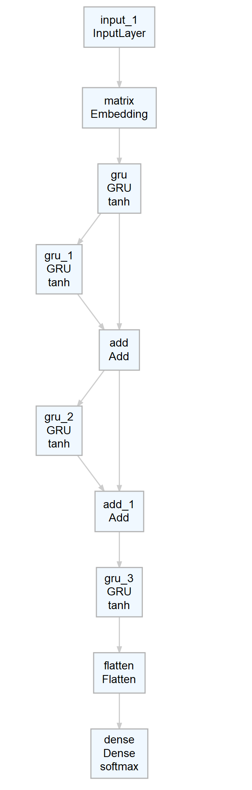

## <span style="color:maroon">Workflow</span>

Code is written in R, heavy looping and complex operations are done in C++ and then called via R API.

### <span style="color:maroon">1. Tokenizer</span>

#### <span style="color:maroon">1.1. Creating dictionary:</span>

  FOR WHOLE DATASET:

  - Count all different job titles (all lower case). 
  - Take 40% most common ones, replace special characters (&,/)
  - Cluster missspellings with Jaro Winkler distance.
  - Translate non english job titles via Google API.
  - Cluster translations with current dictionary.
  - Check translations by hand.
  - Tokenize whole dictionary.
  


#### <span style="color:maroon">1.2. Assign tokens to job title:</span>

  FOR EACH JOB TITLE:
  
  - Remove special characters.
  - Check if job title is already in dictionary, from longer to shorter phrases. 
  
  IF NONE MATCHED:
  
  - Check if new job title contains anything from the dictionary
  - Example: "sen. financial manager" is not in dictionary but "financial manager" is. 
  - Assign all tokens form dictionary from all matched job titles. 
  
  IF STILL NONE MATCHED:
  
  - Calculate Jaro Winkler distance to all phrases from dictionary; if distance is small enough (1. threshold), match to the one with minimum distance.
  - Catching misspellings.
  
  IF ONLY 1 TOKEN FROM PARTIAL MATCHING:
  
  - Calculate Jaro Winkler distance to all phrases from dictionary; if distance is small enough (2. threshold), match to the one with minimum distance.
  - Searching for additional tokens.
  
  For simplicity described in steps, I do no calculate distance matrix twice.


### <span style="color:maroon">2. LDA</span>

#### <span style="color:maroon">2.1. Algorithm: </span>

  - Remove long tails of tokenize data.
  - Prepare corpus and run an algorithm.
  - LDA made fine clusters but couldn't really classify well.
  
#### <span style="color:maroon">2.2. Beta probabilities: </span>

  - Extract B = Beta Probabilities from the LDA. 
  - Each token has specific beta for each cluster. Sum of all tokens' beta for specific cluster is 1.
  - Create another view, so that sum of beta's for each token is 1. So make all tokens equivalent. (before sum of "manag" betas is around 100 times larger than sum of "python" betas)
  
#### <span style="color:maroon">2.3. Skill classification: </span>

  FOR EACH TOKENIZED JOB TITLE:
  
  - Sum pointers to each cluster for each token.
  - First with original betas.
  - Then with transformed betas.
  - So now we have pointers (sum of token's beta for each cluster) done in 2 different ways. 
  - For each job title, we obtain a vector of length 100, where 1. and 51. value represent how much the title matches cluster 1.
  

### <span style="color:maroon">3. Deep Learning</span>

#### <span style="color:maroon">3.1. Idea: </span>

  - Idea is to give the network same input as we have given the LDA and to teach her to predict vector from point 2.3.
  - So she has to learn both representaions at the same time and we are hoping that the effort will result in good embedding matrix (as it does).
  

#### <span style="color:maroon">3.2. Model construction: </span>

  - Input: Sequence of tokens.
  - Embedding layer (128 units).
  - Gate recurrent layer X(32 units).
  - Gate recurrent layer Y of X(32 units).
  - Residual connection Z, adding X and Y.
  - Gate recurrent layer W of Z(32 units).  
  - Residual connection Q, adding U and W.
  - Gate recurrent layer F of Q(32 units).
  - Flatteing and dense layer with 100 units and softmax activation.
  
#### Visual representaion:

```{r,echo=F, out.width=250}

```
  

### <span style="color:maroon">4. Construction of vectorized clusters:</span>

 - For each cluster (of our 50) sum as many beta (original) as needed to reach 97.5 % cover.
 - Adjust the weights of selected tokens (now they sum to 0.975) so they sum to 1.
 - Sum vectors of selected tokens multiplied with their weights. 
 - We have obtained vectors that represent each of the clusters given by LDA.
 - Repeat the same for transformed betas, now with the 85 % cover.
 - Now we have obtain second space (As far as my analysis went, the original beta are better representaion). 
 
 


#### Jakob


  